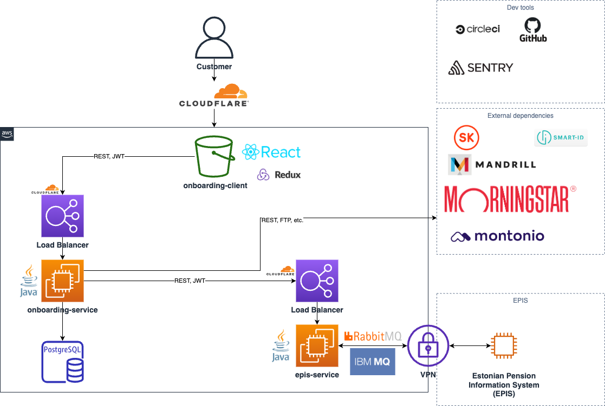

# Onboarding-service

[](https://circleci.com/gh/TulevaEE/onboarding-service/tree/master)
[](https://snyk.io/test/github/TulevaEE/onboarding-service)
[](https://codecov.io/gh/TulevaEE/onboarding-service)

## Architecture


## Prerequisites

- JDK 21
- Groovy
- Git
- Gradle
- Lombok
- IntelliJ
- [AWS Toolkit for IntelliJ](https://aws.amazon.com/intellij/)
- Docker

## Tech stack

**Database**

PostgreSQL

Running locally with Docker: `docker compose up database -d`

**Spring Profile**

IMPORTANT: Set your Spring active profile to `dev` - this will also run DB schema/dev data migration

**Backend**

Java 21, Spring Boot, Gradle, Spock for testing

Running locally: `./gradlew bootRun`

**Testing**

Tests can run against either H2 in-memory database or PostgreSQL via Testcontainers:

- `./gradlew test` - runs against H2 in-memory database (default, fast)
- `SPRING_PROFILES_ACTIVE=ci,test ./gradlew test` - runs against PostgreSQL via Testcontainers (requires Docker to be running)

Some tests require PostgreSQL-specific features (jsonb, advanced queries) and will be skipped when running against H2. These tests are annotated with `@Requires` to only run when the `ci` profile is active or `CI=true` environment variable is set.

**Note:** Docker must be running for Testcontainers to work when using the `ci` profile.

**Frontend**

React, TypeScript, scss, custom bootstrap, react-testing-library

**Exception Monitoring**

Sentry

**Analytics**

Google Analytics / Mixpanel

**Hosting**

AWS Elastic BeanStalk: EC2 and ELB

**Continuous Integration**

CircleCI

**Production Logs**

Papertrail

### API

Authentication: oAuth2 with Mobile-ID, ID-card and Smart-ID

[Swagger UI](https://onboarding-service.tuleva.ee/swagger-ui/)

[Postman API collection](reference/api.postman_collection) (outdated)


### Build pipeline

**Production:**
Merge GitHub pull request to master -> build in CircleCI -> auto-redeploy (if build is green)

### How to add new pension funds?
1. Add the new fund to the `funds` database table.

### Development notes

Code style:
[Java](https://github.com/google/styleguide/blob/gh-pages/intellij-java-google-style.xml),
[Kotlin](https://github.com/pinterest/ktlint#-with-intellij-idea)

If you don't want to run epis-service,
then you can use `mock` spring profile to mock EpisService, and adjust `MockEpisService` to your needs.

### Common Issues

`error="unsupported_grant_type", error_description="Unsupported grant type: mobile_id"`

Make sure you are running against the right backend environment (dev or prod).
- If you do `npm run develop` your `package.json` must proxy to `http://localhost:9000`
- If you do `npm run develop-production` your `package.json` must proxy to `https://onboarding-service.tuleva.ee`

### Known Issues

- Digital signing does not work in the dev environment. Use the production
 configuration to test it locally. See `DigiDocConfiguration.digiDocConfigDev()` and
  `smartid.hostUrl`, `smartid.relyingPartyUUID`, `smartid.relyingPartyName` config
   values in `application.yml` and change them to production values. Use VPN for testing.

### Caveats

When updating Spring Boot, sometimes you need to remove all of the existing access tokens from the
`oauth_access_token` database table. However, there's one special token granted for tuleva.ee which
allows it to fetch Fund NAV values and register new users. In order to generate a new token, you need to:
token by
```
curl --location --request POST 'https://pension.tuleva.ee/api/oauth/token' \
--header 'Authorization: Basic <base64 of client_id:client_secret>' \
--data-urlencode 'grant_type=client_credentials' \
--data-urlencode 'client_id=tuleva.ee'
```
and then [update the token values](https://github.com/TulevaEE/wordpress-theme/commit/1796c1ba7c926847ff0edb3b9f8a61e273d40018) in the WordPress Tuleva template.

### Swedbank Gateway

#### Certificates
Download `swedbank-gateway.p12` from `tuleva-secrets/staging` from `S3` and place it in `test_keys`.


#### Account fetcher
For `swedbank-gateway.accounts` in `application.yml`, use `EE062200221055091966` for test account variables.

### Testing ID-card Locally

In order to test ID-card locally, you need to run nginx locally with the right certificates and the right domain names.

1. Add tuleva certs to `./nginx` (4 files)
2. Update ```$frontend``` and `$backend` urls in `etc/eb/.ebextensions/nginx/conf.d/01_ssl_proxy.conf`
3. Add to `hosts` file:
   ```
   127.0.0.1 id.tuleva.ee
   127.0.0.1 pension.tuleva.ee
   127.0.0.1 onboarding-service.tuleva.ee
   ```
4. Run nginx with docker: `docker compose up nginx`
5. Add `DANGEROUSLY_DISABLE_HOST_CHECK=true` to `.env` in `onboarding-client`
6. add `server.servlet.session.cookie.domain: tuleva.ee` to `application.yml`
7. Test through https://pension.tuleva.ee
8. Later, don't forget to clean up your `hosts` file

### AWS Profile
WE use AWS SSO, to get it working properly you need to configure the profile first either by running `aws configure sso` or
pasting the following into `~/.aws/config`:
```ini
[profile tuleva]
region = eu-central-1
output = json
sso_start_url = https://tuleva.awsapps.com/start
sso_region = eu-central-1
sso_account_id = 641866833894
sso_role_name = AdministratorAccess
```

### VPN

We use AWS Client VPN. To get started, log into [AWS SSO Portal](https://tuleva.awsapps.com/start) and follow VPN Client Self Service instructions.

### Connecting to the database

- Establish VPN connection
- Configure AWS Profile and login `aws sso login`
- Connect to the DB using AWS IAM authentication where user is `iamuser` and profile `tuleva`.

### Development Environment
Configuration is available AWS S3 `s3://tulevasecrets/development-configuration/`


## Certificate upgrade

### RDS

1. Update `.pem` file in `etc/docker`
2. If file was renamed, rename it in `gradle/packaging.gradle.kts`

In case file has multiple certificate chains, `import-certs.sh` will add all of them.

### Smart-ID, Mobile-ID, ID-card
1. Install keystore explorer if missing `brew install --cask keystore-explorer` or use command line `keytool`
2. Navigate to the `tuleva-secrets` S3 bucket, open either `staging` or `development` directory, download `truststore.jks`.
3. Add new certs and upload new version back to S3 bucket.
   * If there are errors with multiple certificates, either remove or split them by opening the `.pem` file with a text editor.
     * For example a root cert might be added (unnecessarily for our use case) to the cert you are trying to add to the truststore
   * When changing `staging` certs, also add them to `src/test_keys/truststore.jks` for your local `dev` environment.
4. Do a clean deploy to ensure that new EC2 instance is spun up, and S3 -> EC2 files defined in`.ebextensions/keystore.config` are copied over.


### PostgreSQL <-> H2 compatibility for integration tests

PostgreSQL (used while running the application) and H2 (used while running integration tests) have slightly different support for features, requiring some to be stubbed.  
When adding a new migration for H2 <-> Postgres compatibility, the name must be `V1_{n-1}_1__.sql` for Flyway to execute the compatibility migration **before** it tries to execute the migration numbered `n`, for which the compatibility migration is required.

### Adding mandrill emails

1. Create email type with unique template name.
2. In [Mailchimp](mailchimp.com), under Content -> Email templates, add a template with the same name and `_et`
   and `_en` prefix for languages. Click dropdown arrow in list view -> Send to mandrill.

* Use available merge vars as well.

3. In [Mandrill](mandrillapp.com), add a subject line for both templates.

#### References

[hwcrypto.js](https://github.com/hwcrypto/hwcrypto.js)

[hwcrypto Sequence Diagram](https://github.com/hwcrypto/hwcrypto.js/wiki/SequenceDiagram)

[Test Authentication Methods](https://www.id.ee/en/article/testing-the-services/)

[Test Mobile ID](https://demo.sk.ee/MIDCertsReg/)

[Test ID Card](https://demo.sk.ee/upload_cert/)

[Test Smart ID](https://github.com/SK-EID/smart-id-documentation/wiki/Smart-ID-demo)

# Using AWS
## Athena for log search

Service logs are at `tuleva-papertrail Europe (Paris) eu-west-3`
which means, that you need to use `eu-west-3` Athena output S3 bucket.

Load Balancer logs are located at `logs.tuleva.ee` bucket.

Service log table example
```
CREATE EXTERNAL TABLE IF NOT EXISTS `s3papertraillogsdatabase`.`S3PaperTrailLogsTableTSV` (
  `ingestion_time` bigint,
  `request_date` string,
  `request_time` string,
  `log_id` bigint,
  `env` string,
  `originating_ip` string,
  `user_type` string,
  `log_level` string,
  `log_file` string,
  `message` string
)
PARTITIONED BY (`dt` string)
ROW FORMAT SERDE 'org.apache.hadoop.hive.serde2.lazy.LazySimpleSerDe'
WITH SERDEPROPERTIES ('field.delim' = '\t')
STORED AS INPUTFORMAT 'org.apache.hadoop.mapred.TextInputFormat' OUTPUTFORMAT 'org.apache.hadoop.hive.ql.io.HiveIgnoreKeyTextOutputFormat'
LOCATION 's3://tuleva-papertrail/logs/';
```

Then run `MSCK REPAIR TABLE S3PaperTrailLogsDatabase.s3papertraillogstabletsv;`
For partitioning.

And query `select * from s3papertraillogsdatabase.s3papertraillogstabletsv limit 10;`

## Adding VPN routes
For example, Pensionikeskus new IP-s
1. Allow new routes in `private-rounting` tables for [VPCs](https://eu-central-1.console.aws.amazon.com/vpcconsole/home?region=eu-central-1#vpcs:) 
2. Update `static routes` for [VPN](https://eu-central-1.console.aws.amazon.com/vpcconsole/home?region=eu-central-1#VpnConnections:)

## Configuring VPN Split Tunneling

To configure traffic routing through a VPN split tunnel:

1. Open **Client VPN endpoints** and select the relevant VPN.

2. Under **Route Table**, create a new route specifying the desired IP address with the designated subnet.

3. In **Authorization Rules**, add the desired IP and set the appropriate access level.

4. If you need to register the gateway IP with an external party and need to double-check VPN internet gateway IP
   1. use:
      ```bash
      dig ipv4.icanhazip.com
      ```
   2. And take note of the IPs for `icanhazip.com`. Add a new route and authorization rule similarly to steps 2 and 3 (currently done at ip `104.16.184.241`) and establish the gateway ip 
   3. Connect to VPN
   4. To check VPN internet gateway IP
      ```bash
       curl -H "Host: ipv4.icanhazip.com" http://104.16.184.241
      ```

# Updating dependencies
## Spring Boot
Update `io.hypersistence:hypersistence-utils-hibernate` version as well
