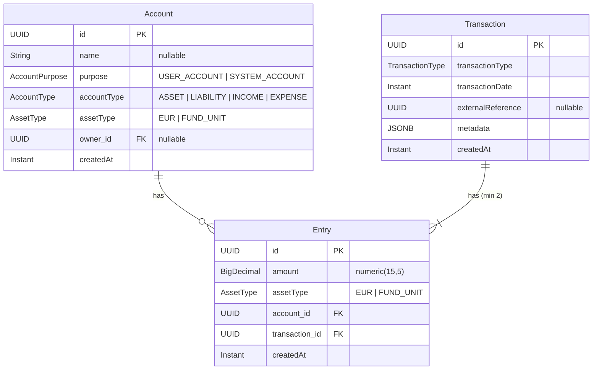

# Ledger Schema

```mermaid
erDiagram
    Account {
        UUID id PK
        String name "nullable"
        AccountPurpose purpose "USER_ACCOUNT | SYSTEM_ACCOUNT"
        AccountType accountType "ASSET | LIABILITY | INCOME | EXPENSE"
        AssetType assetType "EUR | FUND_UNIT"
        UUID owner_id FK "nullable"
        Instant createdAt
    }

    Transaction {
        UUID id PK
        TransactionType transactionType
        Instant transactionDate
        UUID externalReference "nullable"
        JSONB metadata
        Instant createdAt
    }

    Entry {
        UUID id PK
        BigDecimal amount "numeric(15,5)"
        AssetType assetType "EUR | FUND_UNIT"
        UUID account_id FK
        UUID transaction_id FK
        Instant createdAt
    }

    Account ||--o{ Entry : "has"
    Transaction ||--|{ Entry : "has (min 2)"
```
